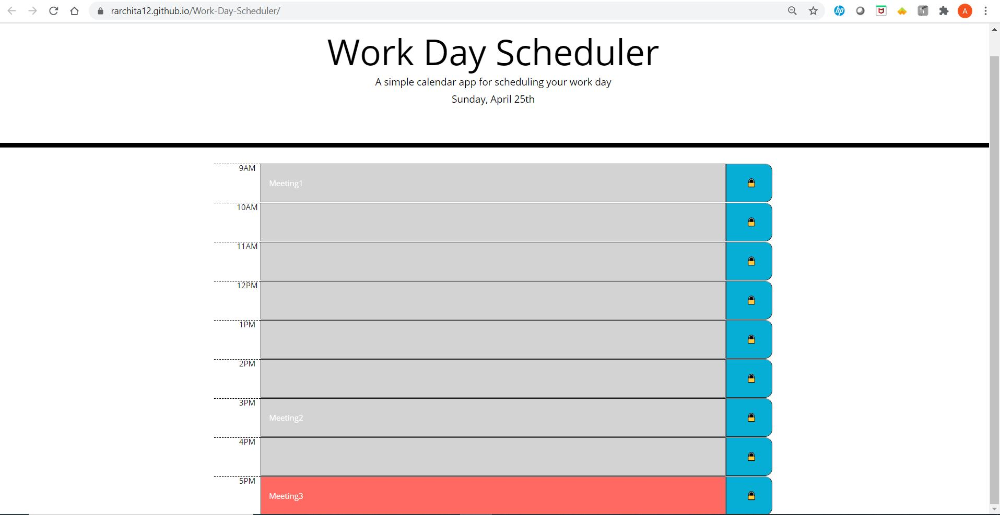

# Work Day Scheduler

## Purpose

A website that offers a real-time work day scheduler. Allows you to add events for the current day and each time block is color-coded to indicate whether it is in the past, present, or future.

## Built With

- HTML
- CSS
- JavaScript
- JQuery
- BootStrap

## Website

https://rarchita12.github.io/Quiz/

## Contribution

Made by Archita
